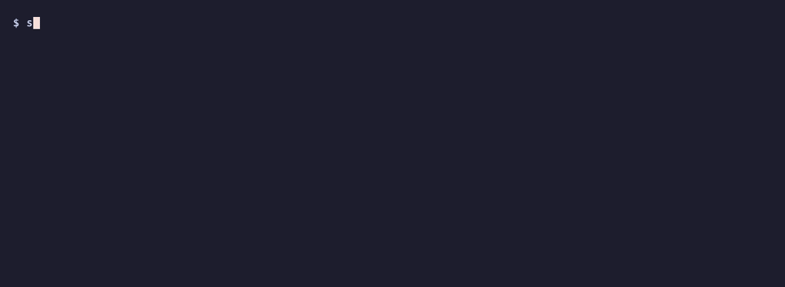
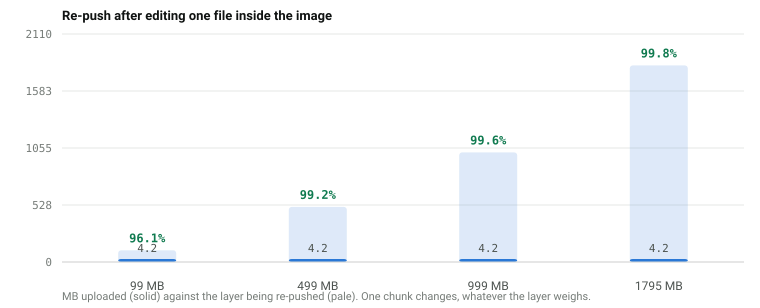
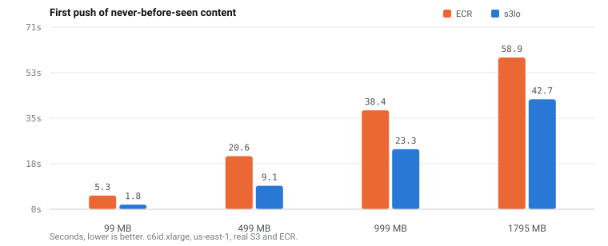
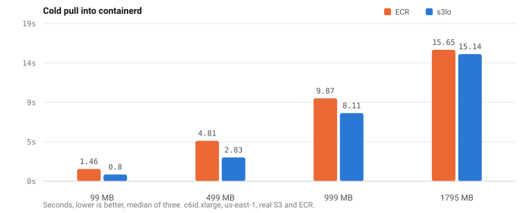

# s3lo

Use S3, GCS, Azure Blob, or local storage as a container image registry. Faster pulls, cheaper storage, no registry to manage.



[](https://github.com/OuFinx/s3lo/actions/workflows/ci.yml)
[](https://github.com/OuFinx/s3lo/releases)
[](https://goreportcard.com/report/github.com/OuFinx/s3lo)
[](https://opensource.org/licenses/MIT)

## Why s3lo?

| | ECR | s3lo |
|---|---|---|
| **Re-push after editing one file** | whole layer again | one chunk (~4 MB) |
| **Deduplication** | whole layers only | content-defined chunks, bucket-wide |
| **Read one file out of an image** | pull the layer holding it | fetch the chunks holding it (`s3lo cat`) |
| **First push, 1.8 GB image** | 58.9 s | 42.7 s |
| **Cold pull, 1.8 GB image** | 15.65 s | 15.14 s |
| **Storage cost** | $0.10/GB/month | $0.023/GB/month |
| **Registry management** | Lifecycle policies, permissions | Just a bucket |
| **Cloud support** | AWS only | AWS S3, GCS, Azure Blob, MinIO, R2, Ceph |

### Measured numbers

<picture>
  <source media="(prefers-color-scheme: dark)" srcset="docs/assets/bench-dedup-dark.svg">
  
</picture>

A registry re-uploads the whole layer for this edit. s3lo re-uploads the one
chunk that changed — the same 4.2 MB whether the layer is 108 MB or 1.8 GB.

<picture>
  <source media="(prefers-color-scheme: dark)" srcset="docs/assets/bench-push-dark.svg">
  
</picture>

<picture>
  <source media="(prefers-color-scheme: dark)" srcset="docs/assets/bench-pull-dark.svg">
  
</picture>

Measured on a `c6id.xlarge` in us-east-1, containerd via `crictl`, layers on
local NVMe, median of three cold pulls. Payloads built from real Python wheels
(gzip 2.15x, zstd 2.69x).

| Payload | Pull ECR | Pull s3lo | Push ECR | Push s3lo | Re-push s3lo |
|---|---|---|---|---|---|
| 99 MB | 1.46 s | 0.80 s | 5.3 s | 1.8 s | 4.2 MB (96.1% dedup) |
| 499 MB | 4.81 s | 2.83 s | 20.6 s | 9.1 s | 4.2 MB (99.2%) |
| 999 MB | 9.87 s | 8.11 s | 38.4 s | 23.3 s | 4.2 MB (99.6%) |
| 1795 MB | 15.65 s | 15.14 s | 58.9 s | 42.7 s | 4.2 MB (99.8%) |

`serve` hands containerd the stored chunks untouched — a valid zstd stream,
since zstd frames concatenate — so containerd decompresses exactly as it does
for any registry, and s3lo moves 5-7% fewer bytes than ECR does. The pull margin
is widest on small images and closes to a tie at 1.8 GB, where both sides are
bound by decompressing and unpacking the layer rather than by fetching it.

This is one node pulling one image, which is what a pod start is. It says
nothing about registry behaviour under simultaneous scale-out — that was not
tested and is not claimed.

## Quick Start

### Install

**Quick install (recommended):**
```bash
curl -sSL https://raw.githubusercontent.com/OuFinx/s3lo/main/install.sh | sh
```

**Homebrew (macOS/Linux):**
```bash
brew install OuFinx/tap/s3lo
```

**Manual download:**

<details>
<summary>Platform-specific binaries</summary>

**macOS (Apple Silicon):**
```bash
curl -Lo s3lo.tar.gz https://github.com/OuFinx/s3lo/releases/latest/download/s3lo_darwin_arm64.tar.gz
tar xzf s3lo.tar.gz && sudo mv s3lo /usr/local/bin/
```

**macOS (Intel):**
```bash
curl -Lo s3lo.tar.gz https://github.com/OuFinx/s3lo/releases/latest/download/s3lo_darwin_amd64.tar.gz
tar xzf s3lo.tar.gz && sudo mv s3lo /usr/local/bin/
```

**Linux (amd64):**
```bash
curl -Lo s3lo.tar.gz https://github.com/OuFinx/s3lo/releases/latest/download/s3lo_linux_amd64.tar.gz
tar xzf s3lo.tar.gz && sudo mv s3lo /usr/local/bin/
```

**Linux (arm64):**
```bash
curl -Lo s3lo.tar.gz https://github.com/OuFinx/s3lo/releases/latest/download/s3lo_linux_arm64.tar.gz
tar xzf s3lo.tar.gz && sudo mv s3lo /usr/local/bin/
```

**From source:**
```bash
go install github.com/OuFinx/s3lo/v2/cmd/s3lo@latest
```

</details>

**Shell completion:**
```bash
s3lo completion zsh  > "${fpath[1]}/_s3lo"       # zsh
s3lo completion bash > /etc/bash_completion.d/s3lo
s3lo completion fish > ~/.config/fish/completions/s3lo.fish
```

### Usage

```bash
# Push a local Docker image to S3
s3lo push myapp:v1.0 s3://my-bucket/myapp:v1.0

# Pull from S3 into local Docker
s3lo pull s3://my-bucket/myapp:v1.0

# Copy from any registry — bare names work just like docker pull
s3lo copy alpine:latest s3://my-bucket/alpine:latest
s3lo copy nginx:1.25 s3://my-bucket/nginx:1.25
s3lo copy 123456789.dkr.ecr.us-east-1.amazonaws.com/myapp:v1.0 s3://my-bucket/myapp:v1.0
s3lo copy s3://source-bucket/myapp:v1.0 s3://dest-bucket/myapp:v1.0

# List images in a bucket
s3lo list s3://my-bucket/

# Inspect image metadata
s3lo inspect s3://my-bucket/myapp:v1.0

# Read one file out of an image, fetching only the chunks that hold it
s3lo cat s3://my-bucket/myapp:v1.0 /etc/os-release

# Show storage stats and deduplication savings
s3lo bucket stats s3://my-bucket/

# Delete a tag
s3lo delete s3://my-bucket/myapp:v1.0

# Configure lifecycle rules (keep last 10 tags, max 90 days)
s3lo config set s3://my-bucket/ lifecycle.keep_last=10 lifecycle.max_age=90d

# Clean old tags and unreferenced blobs (dry run by default)
s3lo bucket clean s3://my-bucket/
s3lo bucket clean s3://my-bucket/ --confirm

# Enable per-image tag immutability
s3lo config set s3://my-bucket/myapp immutable=true

# Browse and manage images interactively
s3lo tui s3://my-bucket/

# Sign an image with AWS KMS (FIPS 140-2, CloudTrail audit log)
s3lo security sign s3://my-bucket/myapp:v1.0 --key awskms:///alias/release-signer

# Sign with a local key file
COSIGN_PASSWORD=secret s3lo security sign s3://my-bucket/myapp:v1.0 --key cosign.key

# Verify a signature (exit 0 = valid, 1 = invalid/missing, 2 = infra error)
s3lo security verify s3://my-bucket/myapp:v1.0 --key awskms:///alias/release-signer
s3lo security verify s3://my-bucket/myapp:v1.0 --key cosign.pub --output json

# --- Google Cloud Storage ---
s3lo push myapp:v1.0 gs://my-gcs-bucket/myapp:v1.0
s3lo pull gs://my-gcs-bucket/myapp:v1.0
s3lo list gs://my-gcs-bucket/

# --- Azure Blob Storage ---
AZURE_STORAGE_ACCOUNT=mystorageaccount s3lo push myapp:v1.0 az://my-container/myapp:v1.0
AZURE_STORAGE_ACCOUNT=mystorageaccount s3lo pull az://my-container/myapp:v1.0

# --- S3-compatible (MinIO, Cloudflare R2, Ceph) ---
s3lo push myapp:v1.0 s3://my-bucket/myapp:v1.0 --endpoint http://localhost:9000
s3lo pull s3://my-bucket/myapp:v1.0 --endpoint http://localhost:9000

# --- Local storage (no cloud account needed) ---

# Initialize local storage
s3lo bucket init --local ./local-s3

# Push and pull with local://
s3lo push myapp:v1.0 local://./local-s3/myapp:v1.0
s3lo pull local://./local-s3/myapp:v1.0
s3lo list local://./local-s3/
```

## How It Works

s3lo stores container images on S3 using the [OCI Image Layout](https://github.com/opencontainers/image-spec/blob/main/image-layout.md) format. Each layer is stored as a separate S3 object, enabling parallel downloads and cross-image deduplication.

```
s3://my-bucket/myapp/v1.0/
--�------ index.json              # OCI Image Index
--�------ manifest.json           # OCI Manifest
--�------ config.json             # Image Config
--------- blobs/sha256/
    --�------ a1b2c3d4...         # Layer 1 (shared with other images)
    --�------ e5f6g7h8...         # Layer 2
    --------- i9j0k1l2...         # Layer 3
```

**Push** exports a Docker image, splits it into content-addressable layers, and uploads them to S3 in parallel. Existing layers are skipped (deduplication via SHA256).

**Pull** downloads layers from S3 in parallel and imports the image into the local Docker daemon.

## Authentication

s3lo uses the standard credential chain for each cloud:

- **AWS S3**: standard AWS credentials chain — environment variables, `~/.aws/credentials`, IAM instance profiles, SSO, etc.
- **GCS**: Application Default Credentials — `GOOGLE_APPLICATION_CREDENTIALS`, `gcloud auth application-default login`, or attached service account.
- **Azure Blob**: `DefaultAzureCredential` — service principal env vars, `az login`, or managed identity. Set `AZURE_STORAGE_ACCOUNT` to your storage account name.
- **S3-compatible**: same as AWS — set `AWS_ACCESS_KEY_ID` and `AWS_SECRET_ACCESS_KEY` for the target service, and pass `--endpoint`.

### AWS S3 — Minimum IAM Policy

```json
{
  "Version": "2012-10-17",
  "Statement": [
    {
      "Effect": "Allow",
      "Action": [
        "s3:GetObject",
        "s3:PutObject",
        "s3:HeadObject",
        "s3:ListBucket",
        "s3:GetBucketLocation"
      ],
      "Resource": [
        "arn:aws:s3:::YOUR-BUCKET",
        "arn:aws:s3:::YOUR-BUCKET/*"
      ]
    }
  ]
}
```

For read-only access (pull only), remove `s3:PutObject`.

## CI Integration

### GitHub Actions

```yaml
- name: Push image to S3
  run: |
    curl -Lo s3lo.tar.gz https://github.com/OuFinx/s3lo/releases/latest/download/s3lo_linux_amd64.tar.gz
    tar xzf s3lo.tar.gz && chmod +x s3lo
    ./s3lo push myapp:${{ github.sha }} s3://my-bucket/myapp:${{ github.sha }}
```

### GitLab CI

```yaml
push-image:
  script:
    - curl -Lo s3lo.tar.gz https://github.com/OuFinx/s3lo/releases/latest/download/s3lo_linux_amd64.tar.gz
    - tar xzf s3lo.tar.gz && chmod +x s3lo
    - ./s3lo push myapp:${CI_COMMIT_SHA} s3://my-bucket/myapp:${CI_COMMIT_SHA}
```

## Use as a Go Library

s3lo exposes its core packages for use in other tools:

```go
import (
    "github.com/OuFinx/s3lo/v2/pkg/ref"     // Parse s3://, gs://, az://, local:// references
    "github.com/OuFinx/s3lo/v2/pkg/oci"     // OCI manifest parsing, Docker export/import
    "github.com/OuFinx/s3lo/v2/pkg/storage" // Storage client (S3, GCS, Azure Blob, local)
    "github.com/OuFinx/s3lo/v2/pkg/image"   // High-level push/pull/list/inspect
)
```

All public APIs accept `context.Context` for cancellation and timeout support.

## Documentation

See the [documentation site](https://oufinx.github.io/s3lo/) for the full reference: all commands with detailed flags and examples, S3 storage layout, deduplication mechanics, IAM policies, Go library usage, CI integration patterns, and FAQ.

For the background story behind the project, read [How I Built an Alternative to Docker Registries Using Just an S3 Bucket](https://tutoria.dev/posts/s3lo-alternative-docker-registry/).

## Contributing

Contributions are welcome! See [CONTRIBUTING.md](CONTRIBUTING.md) for guidelines.

Looking for somewhere to start? Issues labelled [good first issue](https://github.com/OuFinx/s3lo/issues?q=is%3Aissue+is%3Aopen+label%3A%22good+first+issue%22) are small and self-contained.

## License

[MIT](LICENSE)
